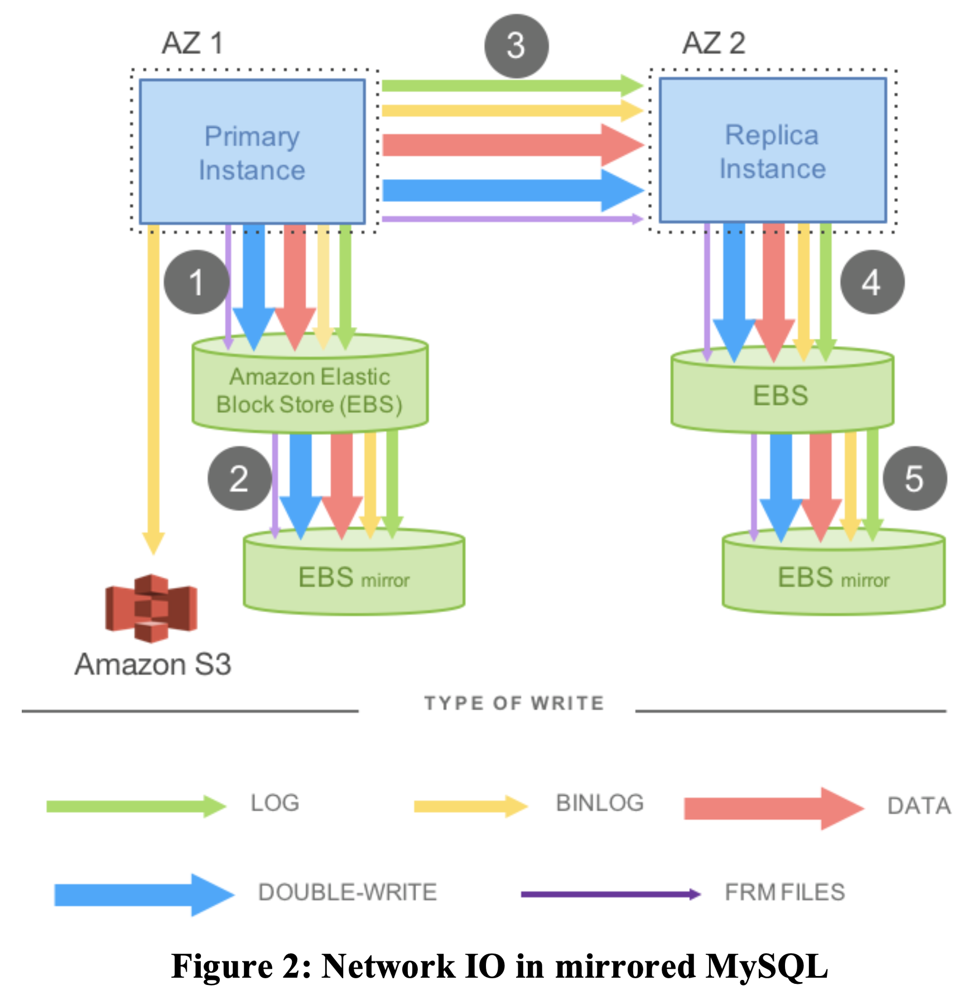

# Amazon Aurora: Design Considerations for High Throughput Cloud-Native Relational Databases

Alexandre Verbitski, Anurag Gupta, Debanjan Saha, Murali Brahmadesam, Kamal Gupta, Raman Mittal, Sailesh Krishnamurthy, Sandor Maurice, Tengiz Kharatishvili, Xiaofeng Bao (Amazon Web Services)

In _Proceedings of the 2017 ACM International Conference on Management of Data (SIGMOD '17)_

[Find original paper using Google Scholar](https://scholar.google.com/scholar?q=Amazon+Aurora%3A+Design+Considerations+for+High+Throughput+Cloud-Native+Relational+Databases)

As IT workloads transition to cloud-native environments, an opportunity arises to re-architect the traditional relational database. Historically, the performance bottleneck for database systems has been the storage I/O. With the advent of modern cloud architectures, it is becoming common to distribute the storage to multiple nodes. This speeds up I/O by exploiting parallelism and redundancy, and has the effect of shifting the performance bottleneck to the network.

The authors designed Aurora to address this issue by decoupling storage from the rest of the database system. The storage service provides a redo log abstraction to the database instance, which includes most of the components of a traditional database kernel. The storage service is primarily responsible for redo logging, durable storage, crash recovery, and backup/restore.

By only writing redo log records to storage, Aurora is able to increase network throughput by an order of magnitude compared to MySQL. Also, decoupling storage makes the overall system more resilient and responsive since storage is now an independent fault-tolerant system and it can process many operations asynchronously from the database instance.

### Durability at Scale

A distributed system must ensure consistency fault-tolerance and consistency. One way to achive this is using quorums:

> If each of the V copies of a replicated data item is assigned a vote, a read or write operation must respectively obtain a read quorum of Vr votes or a write quorum of Vw votes. To achieve consistency, the quorums must obey two rules. First, each read must be aware of the most recent write, formulated as Vr + Vw > V. This rule ensures the set of nodes used for a read intersects with the set of nodes used for a write and the read quorum contains at least one location with the newest version. Second, each write must be aware of the most recent write to avoid conflicting writes, formulated as Vw > V/2.

Based on experience operating distributed systems, a resilient system should tolerate one AZ failure and occasional background noise failures. Therefore, Aurora uses the following strategy for resilience:

> In Aurora, we have chosen a design point of tolerating (a) losing an entire AZ and one additional node (AZ+1) without losing data, and (b) losing an entire AZ without impacting the ability to write data. We achieve this by replicating each data item 6 ways across 3 AZs with 2 copies of each item in each AZ. We use a quorum model with 6 votes (V = 6), a write quorum of 4/6 (Vw = 4), and a read quorum of 3/6 (Vr = 3). With such a model, we can (a) lose a single AZ and one additional node (a failure of 3 nodes) without losing read availability, and (b) lose any two nodes, including a single AZ failure and maintain write availability. Ensuring read quorum enables us to rebuild write quorum by adding additional replica copies.

In this model, the probability of a double fault across AZs must be sufficiently low during the time it takes to repair a failure. Paritioning the data set into small fixed size segments helps with this:

> We instead focus on reducing MTTR to shrink the window of vulnerability to a double fault. We do so by partitioning the database volume into small fixed size segments, currently 10GB in size.

### The Log is the Database

When we take the model we defined in the previous section and try to apply it to a traditional database like MySQL, we see poor performance. This is because MySQL generates many I/O writes for each application write, which in turn are amplified by replication. The result looks something like this:

> The mirrored MySQL model described above is undesirable not only because of how data is written but also because of what data is written. First, steps 1, 3, and 5 are sequential and synchronous. Latency is additive because many writes are sequential.

> From a distributed system perspective, this model can be viewed as having a 4/4 write quorum, and is vulnerable to failures and outlier performance.

Can we do better?

> In Aurora, the only writes that cross the network are redo log records.

> Our approach dramatically reduces network load despite amplifying writes for replication and provides performance as well as durability.

### Performance

The authors show Aurora
- Scales linearly with instance sizes from R3.large to R3.8xlarge
- Significantly exceeds the throughput of MySQL
- Scales with the number of client connections
- Has significantly lower replica lag than MySQL
- Performs very well on workloads with hot row contention

They also present examples of real applications using Aurora:

> An internet gaming company migrated their production service from MySQL to Aurora on an r3.4xlarge instance. The average response time that their web transactions experienced prior to the migration was 15 ms. In contrast, after the migration the average response time 5.5 ms, a 3x improvement as shown in Figure 8.

