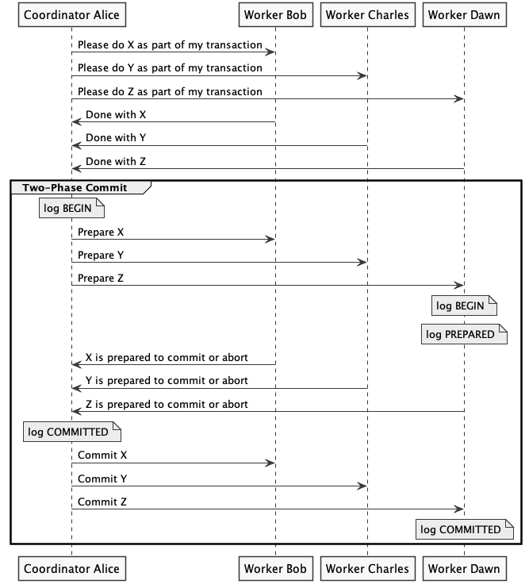

# Principles of Computer System Design: An Introduction

By Jerome H. Saltzer and M. Frans Kaashoek

*Sections 9.1.5, 9.1.6, 9.5.2, 9.5.3, and 9.6.3, as they pertain to distributed transactions*

[Link to Book](https://ocw.mit.edu/resources/res-6-004-principles-of-computer-system-design-an-introduction-spring-2009/online-textbook/)

## 9.1.5 Before-or-After Atomicity: Coordinating Concurrent Threads

**Before-or-after atomicity**
> Concurrent actions have the before-or-after property if their effect from the point of
view of their invokers is the same as if the actions occurred either completely before
or completely after one another. 

Analogy: print jobs. Don't want the lines on the papers interleaved. Doesn't matter which paper gets printed first. Each print job has the before-or-after atomicity property.

## 9.1.6 Correctness and Serialization

**Correctness concept**
> Coordination among concurrent actions can be considered to be correct if every result is guaranteed to be one that could have been obtained by some purely serial application of those same actions

**Serializability concept**
> When concurrent actions have the before-or-after property, they are serializable: there exists some serial order of those concurrent transactions that would, if followed, lead to the same ending state.

Sometimes we need stronger guarantees, e.g.
- External time consistency (transactions at a bank with receipts)
- Sequential consistency (instructions executed on a hyperthreaded CPU)

## 9.5.2 Simple Locking

**Two rules**
> First, each transaction must acquire a lock for every shared data object it intends to read or write before doing any actual reading and writing. Second, it may release its locks only after the transaction installs its last update and commits or completely restores the data and aborts.

Some issues with this approach:
- Missed opportunities for concurrency because we have to lock all resources a transaction *might* touch. Often this is not known beforehand.

## 9.5.3 Two-Phase Locking

> avoids the requirement that a transaction must know in advance which locks to acquire

**How it works**

> The two-phase locking discipline allows a transaction to acquire locks as it proceeds, and the transaction may read or write a data object as soon as it acquires a lock on that object. The primary constraint is that the transaction may not release any locks until it passes its lock point. Further, the transaction can release a lock on an object that it only reads any time after it reaches its lock point if it will never need to read that object again, even to abort

*Interesting: Problem of allowing all possible concurrency while ensuring before-or-after atomicity is NP-complete*

Locks are typically stored in volatile memory. How to recover from a system crash? Since the log has captured a serialization of commands, we just need to undo them in the reverse order back to before the transaction started. This works as long as no other transactions happen which system recovery is happening.

## 9.6.3 Multiple-Site Atomicity: Distributed Two-Phase Commit 

