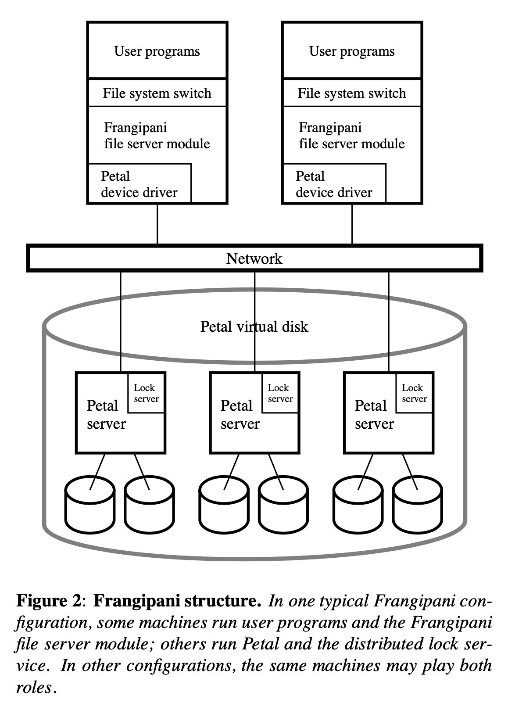
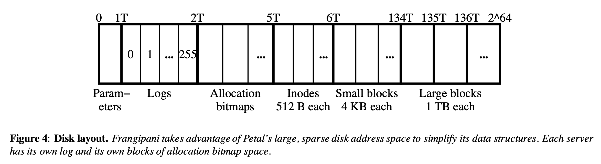

# Frangipani: A Scalable Distributed File System

Chandramohan A. Thekkath, Timothy Mann, and Edward K. Lee (Systems Research Center, Digital Equipment Corporation)

In _Proceedings of the sixteenth ACM symposium on Operating systems principles_, 1997 (SOSP '97)

[Find original paper using Google Scholar](https://scholar.google.com/scholar?q=Frangipani%3A+A+Scalable+Distributed+File+System)

Frangipani is a distributed file system built on top of Petal, a distributed block storage service. It allows shared access to the same set of files stored across multiple underlying machines and is incrementally scalable and highly available.

Other distributed file systems have existed before Frangipani. However, the distinguishing features of Frangipani are its architecture — a two-layered approach which builds on a distribued storage service — and its simplicity and ease of use and administration. Specifically, the features which distinguish Frangipani from other designs are:

> 1. All users are given a consistent view of the same set of files.
> 2. More servers can easily be added to an existing Frangipani installation to increase its storage capacity and throughput, without changing the configuration of existing servers, or interrupting their operation. The servers can be viewed as “bricks” that can be stacked incrementally to build as large a file system as needed.
> 3. A system administrator can add new users without concern for which machines will manage their data or which disks will store it.
> 4. A system administrator can make a full and consistent backup of the entire file system without bringing it down. Backups can optionally be kept online, allowing users quick access to accidentally deleted files.
> 5. The file system tolerates and recovers from machine, network, and disk failures without operator intervention.

Another interesting aspect of this paper is its description of using locking for cache coherence, which will be described in more detail below.

## System Architecture

A typical Frangipani structure looks something like the following. Actual hard disks across multiple machines are abstracted into a Petal virtual disk which is accessed by multiple user workstations over a network.

It's worth noting that Frangipani is designed for simplicity and scaling rather than security and multi-tenancy:

> Any Frangipani machine can read or write any block of the shared Petal virtual disk, so Frangipani must run only on machines with trusted operating systems.

Frangipani uses Petal's disk layout which is similar to other computing models with large address spaces:

## Logging and Recovery

Much of Frangipani's high availability stems from its use of write-ahead redo logging. These logs contain metadata information about the file system itself and not user data. It works as follows:

> Each Frangipani server has its own private log in Petal. When a Frangipani file server needs to make a metadata update, it first creates a record describing the update and appends it to its log in memory. These log records are periodically written out to Petal in the same order that the updates they describe were requested. (Optionally, we allow the log records to be written synchronously. This offers slightly better failure semantics at the cost of increased latency for metadata operations.) Only after a log record is written to Petal does the server modify the actual metadata in its perma- nent locations. The permanent locations are updated periodically (roughly every 30 seconds) by the Unix update demon.

This design is key to Frangipani's simplicity. Since a server's logs are stored in Petal and not only on the server itself, the logs are not lost when a server crashes or experiences a network partition. This allows recovery to be triggered by a client of the failed server, or by the lock service attempting to reclaim a lock and finding that the server is unavailable:

> If a Frangipani server crashes, the system eventually detects the failure and runs recovery on that server’s log. Failure may be detected either by a client of the failed server, or when the lock service asks the failed server to return a lock it is holding and gets no reply. The recovery demon is implicitly given ownership of the failed server’s log and locks. The demon finds the log’s start and end, then examines each record in order, carrying out each de- scribed update that is not already complete. After log processing is finished, the recovery demon releases all its locks and frees the log. The other Frangipani servers can then proceed unobstructed by the failed server, and the failed server itself can optionally be restarted (with an empty log). As long as the underlying Petal vol- ume remains available, the system tolerates an unlimited number of Frangipani server failures.

## Synchronization and Cache Coherence

Frangipani caches data aggressively to achieve good performance. This requires careful synchronization. In a nutshell, it uses multiple-reader/single-writer locks which are managed by a lock service. The key to maintaining cache coherence is a protocol which only allows a server's cached data to be different from the on-disk version if it holds the relevant write-lock:

> A read lock allows a server to read the associated data from disk and cache it. If a server is asked to release its read lock, it must invalidate its cache entry before complying. A write lock allows a server to read or write the associated data and cache it. A server’s cached copy of a disk block can be different from the on-disk version only if it holds the relevant write lock. Thus if a server is asked to release its write lock or downgrade it to a read lock, it must write the dirty data to disk before complying. It can retain its cache entry if it is downgrading the lock, but must invalidate it if releasing the lock.

The choice to make Frangipani servers communicate only with the lock server and the Petal storage service is essential to Frangipani's simplicity. An alternative design could have been to have servers forward dirty data directly to the requester. This could have increased performance at the expense of making the design more complicated.

The lock service uses leases to prevent a failed client from holding a lock indefinitely:

> When a client first contacts the lock service, it obtains a lease. All locks the client acquires are associated with the lease. Each lease has an expiration time, currently set to 30 seconds after its creation or last renewal. A client must renew its lease before the expiration time, or the service will consider it to have failed.

With the description of the lock service, we get a fuller picture of what happens during server crash recovery:

> When a Frangipani server crashes, the locks that it owns cannot be released until appropriate recovery actions have been performed. Specifically, the crashed Frangipani server’s log must be processed and any pending updates must be written to Petal. When a Frangipani server’s lease expires, the lock service will ask the clerk on another Frangipani machine to perform recovery and to then release all locks belonging to the crashed Frangipani server. This clerk is granted a lock to ensure exclusive access to the log. This lock is itself covered by a lease so that the lock service will start another recovery process should this one fail.

The lock service itself is a fully fault-tolerant distributed service which relies on a variant of the Paxos algorithm for consensus.

## Backups and Scaling

Petal makes the process of backing up data and adding/removing servers trivial, because it already has mechanisms for this.

Backups are achieved using Petal's snapshot feature which provides _crash-consistent_ snapshots of data, which means a coherent state the data could have been left in if all the servers were to crash.

Adding servers is as simple as installing Frangipani and pointing it at the Petal virtual disk and lock service. Removing a server is even easier — just turn it off!

## Performance

The authors compare Frangipani/Petal with a performance-tuned commercial file system with local disks, AdvFS. Their goal is to show that the performance can be comparable to an existing commercially used file system.

In the single machine performance tests, Frangipani performs slightly faster in some tests and significantly slower in other tests. In particular, the slowest tests were:

> Tests 1, 4, and 6 indicate that creating files, setting attributes, and reading directories take significantly longer with Frangipani. In practice, however, these latencies are small enough to be ignored by users, so we have not tried very hard to optimize them.

> Frangipani is much slower on the file read test (5b). AdvFS does well on the file read test because of a peculiar artifact of its implementation. On each iteration of the read test, the benchmark makes a system call to invalidate the file from the buffer cache before reading it in. The current AdvFS implementation appears to ignore this invalidation directive. Thus the read test measures the performance of AdvFS reading from the cache rather than from disk. When we redid this test with a cold AdvFS file cache, the performance was similar to Frangipani’s (1.80 seconds, with or without NVRAM).

Frangipani's throughput was similar to AdvFS, although Frangipani had slightly better write throughput and slightly worse read throughput. Frangipani also has significantly less CPU utilization than AdvFS.

Next, the authors test the scalability aspects of Frangipani. They show almost linear scalability with the number of servers added for the modified Andrew Benchmark and uncached read tests. The scaling on write does not scale linearly because the network becomes saturated.

Last, the authors did experiments of lock contention by having one or more readers compete against a single writer for the same file. This seemed to have OK performance as long as read-ahead was disabled.
