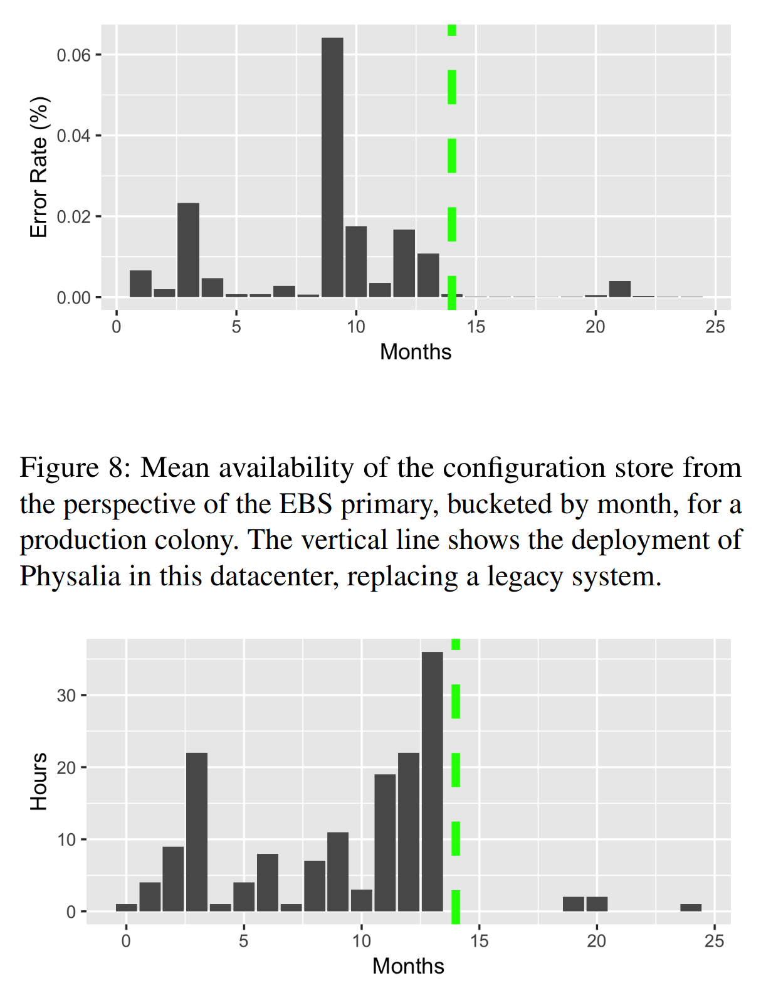

# Millions of Tiny Databases

By Marc Brooker, Tao Chen, Fan Ping (Amazon Web Services)

NSDI '20

Physalia is the configuration store for Amazon Elastic Block Storage (EBS). As a configuration store, it requires the strongest level of consistency which is non-negotiable. However, the designers wanted to achieve a high level of availability as well since it is a critical piece of EBS infrastructure.

> "Instead of being highly available for all keys to all clients, Physalia focuses on being extremely available for only the keys it knows each client needs, from the perspective of that client."

Physalia works around the CAP theorem by focusing on high availability for some keys during a network partition. It achieves this through knowledge of the datacenter: topology, power, and networking, as well as the location of clients that are most likely to access each row.

### Design

- Colony: an entire Physalia installation made of many cells
- Cell: A distributed state machine that manages the data of a single partition key (aka shard)
- Node: Physical or virtual machine that hosts which participate in one or many cells
- Control Plane: Uses knowledge of the datacenter to choose sets of nodes for cells

Consensus is implemented using Paxos over seven nodes. In their Paxos implementation, proposals are accepted optimistically which is more performant under non-failure scenarios. All data is organized under partition keys. Each EBS volume is assigned a unique partition key for its data. Within each partition key, Physalia supports strict serializable consistency over any combination of keys. Most clients use the strict consistency mode. However, Physalia also supports an eventual consistency mode for read operations (used for monitoring and reporting). The API is intentionally kept very simple — fields may be byte arrays, arbitrary precision integers, or booleans. It also supports leases which are lightweight time-bounded locks. Reconfiguration is implemented using a pattern described in [Lampson et. al.](http://dl.acm.org/citation.cfm?id=645953.675640). Reconfiguration happens frequently because the control plan actively moves cells to be close to their clients. There is a discovery cache which is a distributed eventually-consistent cache to help clients figure out which nodes contain a given cell/partition.

### Notes on Availability

Previous works have shown that distributed state machines are effective at achieving high availability during faults of a single machine and uncorrelated failures of a small number of machines. However, Physalia (along with many other cloud systems) also needs to be concerned with large scale correlated failures.

Physalia is a system built of many small distributed state machines. How does it compare to a monolithic state machine?

> "A monolithic system has the advantage of less complexity. No need for the discovery cache, most of the control plane, cell creation, placement, etc. Our experience has shown that simplicity improves availability, so this simplification would be a boon. On the other hand, the monolithic approach loses out on partition tolerance. It needs to make a trade-off between being localized to a small part of the network (and so risking being partitioned away from clients), or being spread over the network (and so risking suffering an internal partition making some part of it unavailable). The monolith also increases blast radius: a single bad software deployment could cause a complete failure (this is similar to the node count trade-off of Figure 4, with one node)."

How does the Physalia control plane choose where to place Physalia cells?

> "If the volume is unavailable at the same time as the client instance, we know that the instance will not be trying to access it. In other words, in terms of the availability of the volume (Av), and the instance (Ai), the control plane optimizes the conditional probability P (Av |Ai )."

Infrastructure faults are not the only reason for large correlated failures. Correlated work, e.g. bugs in software, is another big reason. If a client tries to apply a "poison pill" transaction, which is a transaction that passes validation but cannot be applied to the state machine without causing an error, the system will crash. Therefore, having many small distributed state machines prevents any one software bug from taking out the entire system.

Physalia also tries to prevent failures from operational practices by doing a sort of "canary" rollout of software changes based on colors                    

> "When software deployments and other operations are performed, they proceed color-by-color. Monitoring and metrics are set up to look for anomalies in single colors. Colors also provide a layer of isolation against load-related and poison pill failures."

### Testing

**SimWorld** — Unit tests that run inside a developer’s IDE. Abstracts network, performance, clock, other system components. Makes it easy to write tests that cover a wide range of system conditions and they execute quickly. (Similar to JUnit or DUnit tests in Geode).

> "The key to building a simworld is to build code against abstract physical layers (such as networks, clocks, and disks). In Java we simply wrap these thin layers in interfaces. In production, the code runs against implementations that use real TCP/IP, DNS and other infrastructure. In the simworld, the implementations are based on in-memory implementations that can be trivially created and torn down. In turn, these in-memory implementations include rich fault-injection APIs…"

**TLC model checker** — Automatically generated tests based on a TLA+ specification. Runs their Paxos implementation through every combination of packet loss and reordering that a node can experience. Interesting real-world use case for formal methods!

> "We use TLA+ extensively at Amazon [39], and it proved exceptionally useful in the development of Physalia. Our team used TLA+ in three ways: writing specifications of our protocols to check that we understand them deeply, model checking specifications against correctness and liveness properties using the TLC model checker, and writing extensively commented TLA+ code to serve as the documentation of our distributed protocols. While all three of these uses added value, TLA+’s role as a sort of automatically tested (via TLC), and extremely precise, format for protocol documentation was perhaps the most useful. Our code reviews, simworld tests, and design meetings frequently referred back to the TLA+ models of our protocols to resolve ambiguities in Java code or written communication. We highly recommend TLA+ (and its Pluscal dialect) for this use."

**Jepsen** — Used to test that the API responses are linearizable under network failures. The authors note that Jepsen could execute some cases that were hard to run in the SimWorld.

**Game days** — Simulating failures in real production or production-like deployment. Similar to Chaos Engineering pioneered by Netflix.

> "Game days test not only the correctness of code, but also the adequacy of monitoring and logging, effectiveness of operational approaches, and the team’s understanding of how to debug and fix the system."

### Evaluation

The authors evaluated Physalia using production system metrics and experiments. These evaluations revealed issues with how the system dealt with rollouts and rollbacks, and the authors noted their learnings:

> "Postel’s famous robustness principle (be conservative in what you do, be liberal in what you accept from others) [45] does not apply to dis- tributed state machines: they should not accept transactions they only partially understand and allow the consensus pro- tocol to treat them as temporarily failed."

The following diagram shows highlights the availability of EBS before and after the upgrade to Physalia:

